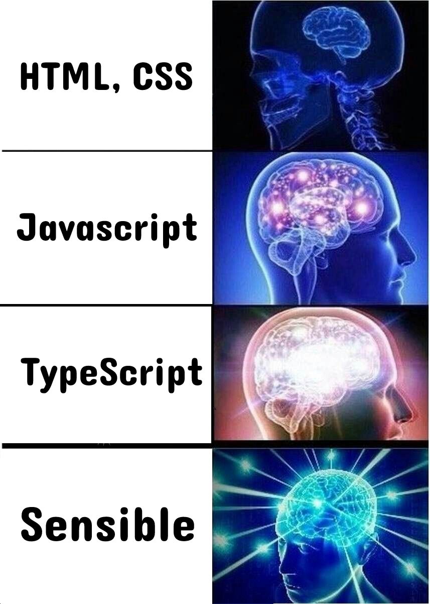
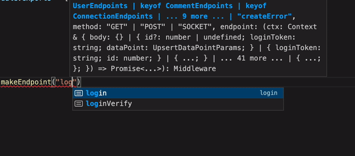
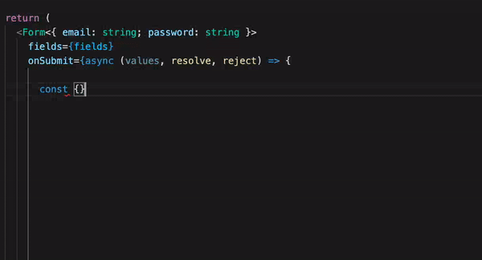
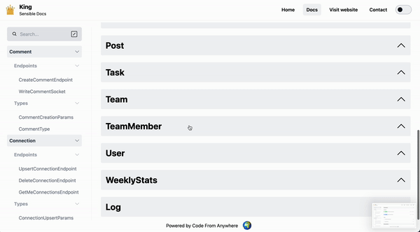

<a href="https://www.sensibleframework.co" target="_blank">
 
www.sensibleframework.co
</a>

# The fastest way to build an app

**The Shared Full Stack Typescript Framework** With strict conventions and the newest typescript and code sharing possibilities, we were able to create the most advanced typescript framework ever and boost the productivity of hundreds of development teams, maybe even by a factor of 10 or more if you compare it to the industry standard.

Sensible's mission is to boost the productivity of 100.000+ Software Developers, making it as easy as possible to build a high-quality full-stack mobile/desktop app/website.

Curious? Just run `yarn create sensible-app APPNAME` and see the magic, or [check out this demo](https://www.youtube.com/watch?v=tL1tcWEgQNo)

This will setup the sensible framework with all node modules installed, a few example models/endpoints. It will also open up VSCode in the correct folder, running the expo packager, next.js site, server, so you can start coding.

  

## How does it work?

Define endpoints (and other type interfaces) in a central place

Write your endpoint with complete typesafety

Call your endpoint with complete type-safety and autocompletion (no boilerplate needed!)

If you need more help, just look in the auto-generated docs!

# The Core Sensible Philosophy

- Codebase introspection
- Documentation generation
- Full-stack code-sharing
- Full-stack auto-completion using Typescript
- KISS
- Maximise learnability

# Useful links

- [docs](/docs)
- [packages](/packages)
