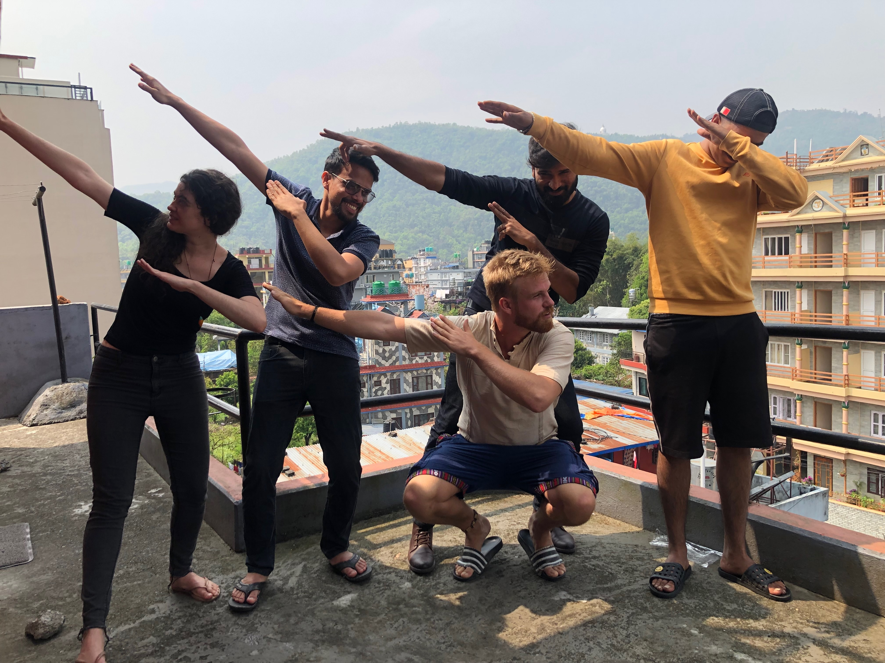

# Junior Full Stack Developer

We're looking for anyone willing to learn how to make full stack typescript apps.

**What we can offer you**

- Weekly guidance guiding you through learning how to make full stack apps with Sensible
- You start with a minimum hourly wage on freelance basis (For example, in the Netherlands, you'll get a minimum of €12 per hour spent in the editor)
- Once you got the basics, you can start working for clients and earn much more. We work with Dutch clients that pay anything from €70 an hour.
- Choose what you want to work on yourself from a very broad range of small projects
- Total freedom in hours worked and location
- A very nice environment to work, a great community

**What you need to offer us**

- A strong work ethic and motivation to become the best in your field and reach your full potential
- A collaborative mindset where you're not afraid to help others in need.
- A will to solve big problems, especially climate change and bad applications of AI
- A positive attitude
- Willingness to not only do software development but also marketing and other stuff, anything, really.

Interested? [join our community](https://sensiblestack.com/) and join `#studygroup` to get in touch.

Wijnand
